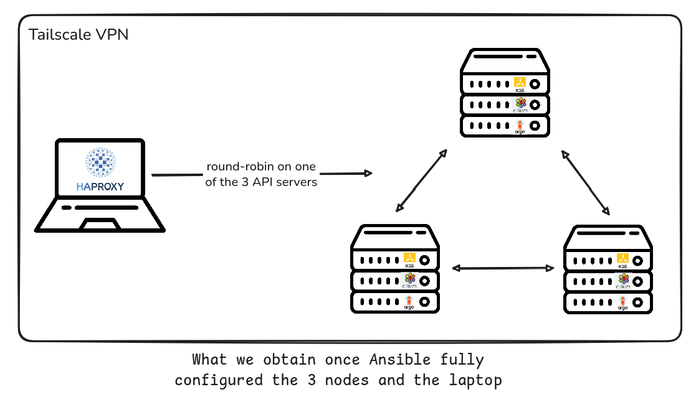
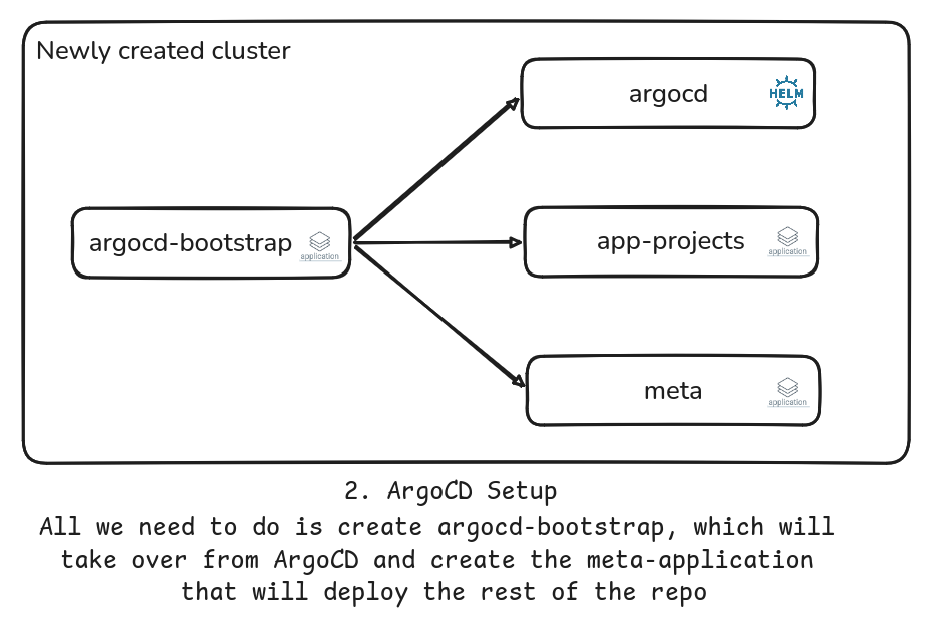
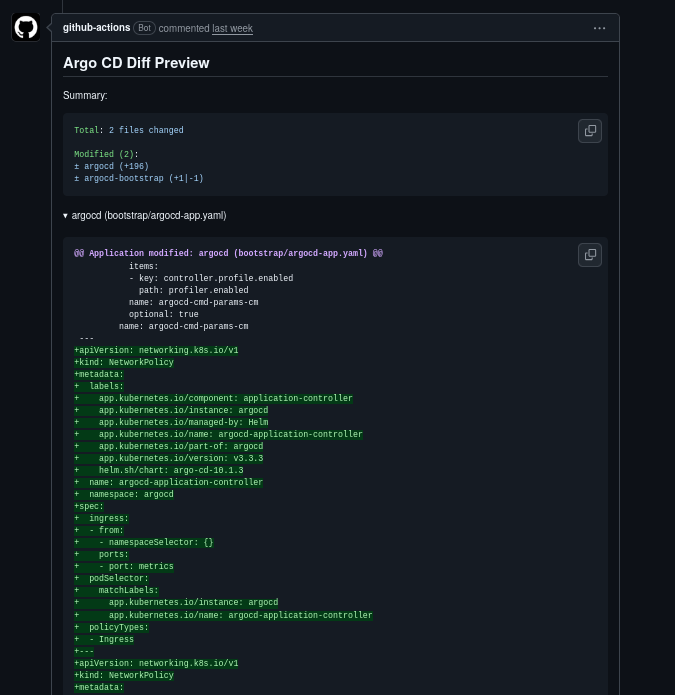

# K3S Homelab

Hey there, welcome to my personal k3s homelab !

This project was born during my internship at Padoa, where I discovered a new passion for infrastructure and the DevOps approach. Just before the internship started, I'd discovered Docker, Kubernetes, and ArgoCD, and I was already completely won over by these technologies. Once I started talking with my colleagues about other tools, and got to work with more of the tech stack used by the firm, I wanted to build my own cluster packed with cool technologies, both for fun and for learning. So here we are.

In short : this is about experimenting with cool technologies to build a resilient cluster, following the DevOps and GitOps approach, with full observability across the whole stack.

## Physical Architecture

Because I study in Compiègne and my parents live near Lille, I saw the opportunity to build a fully resilient architecture, one that can survive even a network or power outage at one location.

My cluster is built around a **k3s HA control-plane** made of **3 NUCs**, split across **2 different houses** (mine and my parents'). They're connected over a **Tailscale** network (mesh VPN), and I use Cilium as the CNI, routing the inter-pod VXLAN network through this tunnel. 

To talk to one of the 3 Kubernetes API servers, a local HAProxy round-robins across the 3 control planes for HA access to the API server: if one node goes down, `kubectl`, ArgoCD, and all my other services keep running without interruption. 

Finally, Longhorn replicates storage (PVCs) across all 3 nodes, so even if a node goes completely down, every service stays available.

## Virtual Architecture

In terms of virtual architecture, it can be explained as a layered stack:
```
┌────────────────────────────────────────────────────┐
│ Application Layer                                           │
│ -> Applications (Immich, Affine, backends, etc.)            │
├────────────────────────────────────────────────────┤
│ Platform Services Layer                                     │
│ -> Longhorn · External Secrets · Networking* · Monitoring** │
├────────────────────────────────────────────────────┤
│ Platform Management Layer                                   │
│ -> ArgoCD · Helm · Renovate                                 │
├────────────────────────────────────────────────────┤
│ Container Orchestration Layer                               │
│ -> K3s · Cilium                                             │
├────────────────────────────────────────────────────┤
│ Operating System Layer                                      │
│ -> Ubuntu                                                   │
└────────────────────────────────────────────────────┘
```

*The "Network stack" is made up of Traefik, cert-manager, and cloudflared (Cloudflare Tunnel).

**The "Monitoring stack" is made up of two stacks:
* The Prometheus + Grafana Labs stack (Grafana, Alloy, Loki, Tempo)
* The EFK stack (Elasticsearch, Fluent Bit, Kibana) + Victoria Metrics

Running both is purely for learning purposes, as I want to be comfortable with a variety of tools and approaches (see [below](#full-observability) for more details).

## Setup

For the cluster, I went with a DevOps approach that's fully reproducible in just a few minutes.

The cluster is first bootstrapped with Ansible, which runs from my laptop and configures each NUC into a (secured) node. All it takes is running `ansible-playbook ./ansible/site.yml`


Once the setup is complete, here's the resulting architecture :



The next step is installing an ArgoCD Application that takes over management of the ArgoCD instance installed by Ansible, and handles deploying the rest of the repo through the `meta` application. For that, we run `kubectl apply -f ./kubernetes/bootstrap-app.yaml`



Finally, all that's left is pulling in the secrets. For that, we need to create a Kubernetes secret in the `infra` namespace called `infisical-universal-auth-credentials`, which lets External Secrets Operator authenticate with Infisical and then recreate every secret defined in the repo (logins, Cloudflare tunnel token, etc.).


And there it is, the cluster is rebuilt from scratch!

The services are then reachable online at `https://mdlmr.fr/*`. And for a bit more visibility into how that works, here's one last diagram ;)


## Maintenance - CI/CD and GitOps

The cluster is driven by **ArgoCD** following a multi-level *app-of-apps* pattern (with sync-waves to guarantee deployment order: ArgoCD itself and its CRDs first, then infra, then monitoring, then the apps), and by **Renovate**, which automatically opens PRs to update Helm charts and Docker images (auto-merged for minor updates, manually reviewed for major ones).

A GitHub Actions workflow, **Argo Diff Preview**, generates the full manifest diff (rendered Helm + Kustomize) and posts it as a comment on every PR. Handy for seeing the impact before merging :)

<p style="display: flex; gap: 20px; justify-content: center;">
  
  
</p>

## Full Observability

Observability is handled by 2 complete stacks:
* The Prometheus and Grafana Labs stack (Prometheus, Grafana, Alloy, Loki, Tempo), as well as
* The EFK stack (Elasticsearch, Fluent Bit, Kibana) - Victoria Metrics - OTel

Both monitoring stacks collect logs and metrics from all deployed services, while the tracing system is currently only used for the Ski'UT backend, where I implemented the OTel SDK to collect traces and inspect particularly slow requests (the bottleneck was usually database connection pooling or poorly factored Eloquent ORM operations).

The point of running 2 monitoring stacks is purely for learning purposes, so I'm comfortable with the Grafana Labs stack as well as other widely used tools (Elasticsearch, Fluent Bit, etc.). Along those lines, I'm also planning to add Mimir and/or Thanos to my stack soon, along with Datadog.

## Real-World Results

In January 2026, this cluster handled load spikes in production from the Ski'UT booking mini-game - **averaging around 150 req/s and peaking at 200 req/s** - absorbed thanks to a Cloudflare cache configured on static assets (mainly images, CSS, and JS), Traefik running as a DaemonSet in front of the cluster, and load balancing tuned by an HPA that could scale from 1 to 3 backend containers under heavy load.


Under normal circumstances, the server also hosts my personal services (Affine as a Notion-like tool, Immich for photos, my personal website, etc.).

## Stack

### Infrastructure & Cluster

| Tool | Role |
|------|------|
|  **k3s** | Lightweight Kubernetes distribution running the cluster |
|  **Cilium** | eBPF-based CNI, replaces kube-proxy, routes inter-pod traffic over the Tailscale VPN |
|  **Tailscale** | Mesh VPN connecting the 3 nodes across 2 houses, plus my laptop |
|  **HAProxy** | Local load balancer, round-robins across the 3 control planes for HA API access |
|  **Ubuntu** | Base OS on every node |
|  **Longhorn** | Distributed block storage, replicates PVCs across all 3 nodes |

### Secrets Management

| Tool | Role |
|------|------|
|  **External Secrets Operator (ESO)** | Syncs secrets from Infisical into native Kubernetes Secrets |
|  **Infisical** | Secrets manager backing ESO |

### Networking & Ingress

| Tool | Role |
|------|------|
|  **Traefik** | Ingress controller, runs as a DaemonSet on hostPort 80/443 |
|  **cert-manager** | Automated TLS certificates via Let's Encrypt |
|  **cloudflared** | Cloudflare Tunnel, exposes services with zero open ports |

### GitOps & CI/CD

| Tool | Role |
|------|------|
|  **ArgoCD** | GitOps continuous delivery, multi-level app-of-apps pattern with sync-waves |
|  **Helm** | Chart packaging, deployed as ArgoCD sources |
|  **Renovate** | Automated PRs for Helm chart & image updates (auto-merged for minors) |
|  **GitHub Actions** | Runs the Argo Diff Preview workflow on every PR |

### Monitoring & Observability

| Tool | Role |
|------|------|
|  **Prometheus** | Metrics scraping across the cluster and apps (via kube-prometheus-stack) |
| **Alertmanager** | Alerting |
|  **Grafana** | Dashboards, single entry point for logs, metrics, and traces |
|  **Alloy** | Unified metrics + logs collector |
|  **Loki** | Log aggregation |
|  **Tempo** | Distributed tracing backend (OTLP-compatible) |
|  **OpenTelemetry (OTel)** | Tracing instrumentation, currently used in the Ski'UT backend |
|  **Elasticsearch** | Log/metric storage for the EFK stack (via ECK Operator) |
|  **Fluent Bit** | Log shipper for the EFK stack (via Fluent Operator) |
|  **Kibana** | EFK stack dashboards |
|  **Victoria Metrics** | Metrics storage, used alongside the EFK stack |

## Just because it looks cool

<div style="display: flex; justify-content: space-evenly; align-items: center; flex-wrap: wrap; gap: 12px; padding: 10px 0;">
  
  
  
  
  
  
  
  
  
  
  
  
  
  
  
  
  
  
  
  
  
  
  
  
  
</div>
